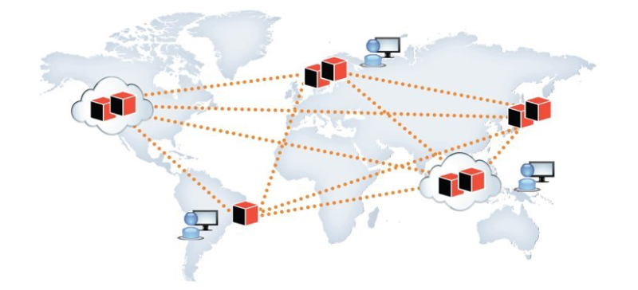

# Bancos de Dados Distribuídos

Bancos de dados distribuídos são sistemas de gerenciamento de informações nos quais os dados são armazenados e processados em múltiplos locais geograficamente separados, muitas vezes em diferentes servidores, data centers ou até mesmo em nuvens distintas. Eles são projetados para fornecer alta disponibilidade, escalabilidade e desempenho, enquanto também oferecem a capacidade de lidar com cargas de trabalho complexas e distribuídas.

## Exemplo de Banco de dados distribuído

### Azure SQL Database
O Azure SQL Database é um serviço de banco de dados totalmente gerenciado oferecido pela Microsoft no Microsoft Azure, que é a plataforma de computação em nuvem da Microsoft. Ele é baseado no sistema de gerenciamento de banco de dados relacional **Microsoft SQL Server** e é projetado para fornecer um ambiente de banco de dados escalável e altamente disponível.

Aqui estão algumas das características do Azure SQL Database que o tornam um sistema distribuído:

1. **Escalabilidade Elástica**: O Azure SQL Database permite dimensionar seu banco de dados de acordo com as necessidades. Isso pode ser feito verticalmente, aumentando o poder de computação e recursos de memória, ou horizontalmente, distribuindo a carga em várias instâncias de banco de dados. Isso é particularmente útil em cargas de trabalho que precisam se expandir para atender ao aumento de demanda.

2. **Alta Disponibilidade**: O Azure SQL Database oferece alta disponibilidade, com replicação de dados em vários nós de dados distribuídos geograficamente. Isso garante a recuperação rápida em caso de falhas e minimiza o tempo de inatividade.

3. **Geo-Replicação**: Você pode configurar a geo-replicação para criar cópias do seu banco de dados em regiões geograficamente separadas. Isso oferece redundância geográfica e recuperação de desastres.

4. **Segurança e Conformidade**: O Azure SQL Database oferece recursos avançados de segurança, incluindo criptografia de dados em repouso e em trânsito, autenticação multifator e conformidade com padrões e regulamentações de segurança.

5. **Recursos de IA e Machine Learning**: O Azure SQL Database pode ser integrado a serviços de Inteligência Artificial (IA) e Aprendizado de Máquina (Machine Learning) do Azure, permitindo a análise avançada de dados e a criação de aplicativos inteligentes.

6. **Integração com Serviços Azure**: Ele se integra facilmente a outros serviços da plataforma Azure, como Azure Active Directory, Azure Functions, Azure Logic Apps, e mais, permitindo a criação de aplicativos e fluxos de trabalho altamente integrados.

7. **Automatização e Monitoramento**: O Azure SQL Database oferece recursos avançados de automação e monitoramento, como a capacidade de ajustar automaticamente o desempenho com base na carga de trabalho e o uso do Azure Monitor para rastrear o desempenho e a integridade do banco de dados.

Em resumo, o Azure SQL Database é uma solução de banco de dados como serviço (DBaaS) altamente distribuída, que permite que empresas executem aplicativos de banco de dados em escala global, com alta disponibilidade, segurança robusta e capacidade de dimensionamento conforme necessário. Isso simplifica a gestão de banco de dados, permitindo que as empresas se concentrem em desenvolver aplicativos e serviços em vez de se preocupar com a infraestrutura de banco de dados subjacente.

---
**Outros Formatos:**
- [Google Docs](https://docs.google.com/document/d/1AY76V9Syu1paOjAQkzJPDjfLMKrZnFTJbShtunYMpr4/edit?usp=sharing)

**Referências:**
- [ChatGPT](https://chat.openai.com/)