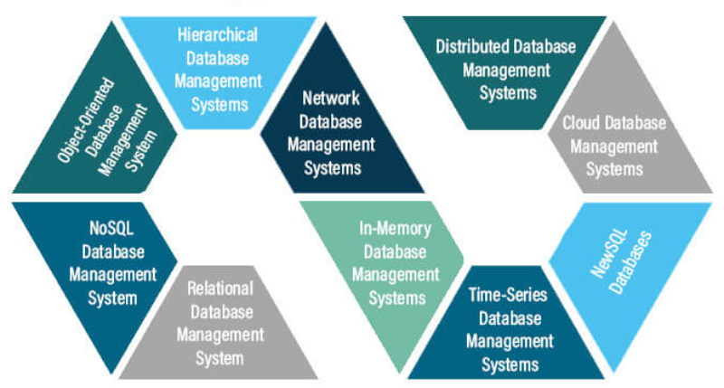

# Bancos por Tópico

## IoT
Internet das Coisas (IoT) é um conceito que se refere à interconexão de dispositivos físicos e objetos do mundo real à internet, permitindo a coleta, transferência e análise de dados para melhorar a eficiência, automação e tomada de decisões.

### Exemplos de banco:
- MySQL
- PostgreSQL

## Big Data
Refere-se a conjuntos de dados extremamente grandes e complexos que ultrapassam a capacidade de gerenciamento de ferramentas de processamento de dados tradicionais.

### Exemplos de banco:
- Hadoop
- Apache Spark

## Blockchain
É uma tecnologia de registro distribuído que visa criar um registro seguro e imutável de transações ou eventos por meio de um livro-razão digital.

### Exemplos de banco:
- Blockchain Público
- Blockchain de Contratos

## BDOO
É um tipo de sistema de gerenciamento de banco de dados que se baseia no paradigma de orientação a objetos para armazenar e recuperar dados.

### Exemplos de banco:
- ObjectDB
- Versant Object Database

## BDOR
É um tipo de sistema de gerenciamento de banco de dados que se concentra em armazenar informações em formato de registro ou documento.

### Exemplos de banco:
- CouchDB
- PouchDB

## BD XML
É um tipo de sistema de gerenciamento de banco de dados projetado especificamente para armazenar e recuperar dados em formato XML.

### Exemplos de banco:
- eXist-db
- BaseX

## BD Móveis
É um tipo de sistema de gerenciamento de banco de dados projetado especificamente para atender às necessidades de aplicativos móveis em dispositivos como smartphones e tablets.

### Exemplos de banco:
- SQLite
- Firebase

## BD Vetorial
É um tipo de sistema de gerenciamento de banco de dados que é projetado para armazenar, gerenciar e consultar dados geoespaciais em formato vetorial.

### Exemplos de banco:
- Hadoop
- Apache Spark

## BD NoSQL
São bancos de dados não relacionais de alto desempenho, onde a principal característica é a flexibilidade na estrutura dos dados.

### Exemplos de banco:
- MongoDB
- HBase

---
**Outros Formatos:**
- [Google Docs](https://docs.google.com/document/d/11dq27YRjPJLBA9yhSSSbR7WHGDC_npuHitFv2JzN-kQ/edit?usp=sharing)
  
