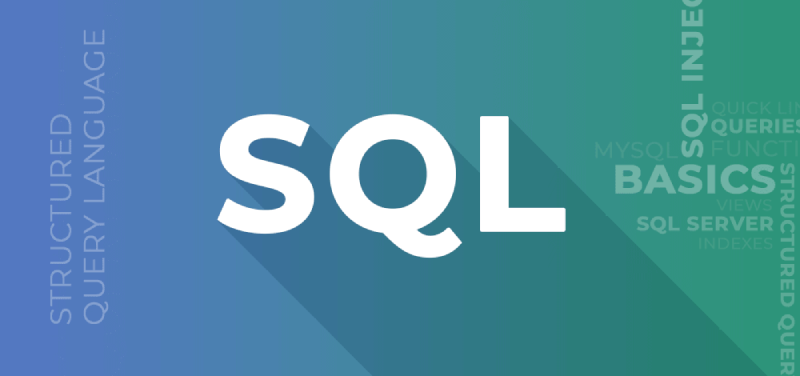

# Correção de Consultas

> **ATIVIDADE**: Adapte os scripts SQL em PostgreSQL [_BD_Inserts.sql_](scripts/DigitalCollege_BD_Inserts.sql) e [_BD_Consultas.sql_](scripts/DigitalCollege_BD_Consultas.sql) para que possam ser executados no SQL Server, corrigindo consultas e ajustando a sintaxe conforme necessário.

## Solução
Foi empregada inteligência artificial generativa para corrigir as consultas e propor melhorias. Abaixo, segue a tabela com os arquivos nos diferentes formatos:

|             | PostgreSQL   | SQL Server
---           | ---          | ---
**Consultas** | [Arquivo SQL](scripts/DigitalCollege_BD_Consultas.sql)  | [Arquivo SQL](scripts/consultas-ajustadas-mssql.sql)
**Inserts**   | [Arquivo SQL](scripts/DigitalCollege_BD_Inserts.sql)  | [Arquivo SQL](scripts/criando-banco-mssql.sql)

---

**Referências:**
- [ChatGPT](https://chat.openai.com/)
