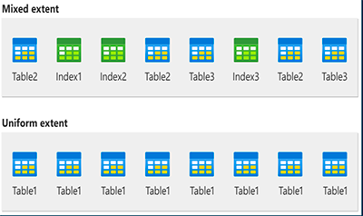

# Extends
Extends são a unidade básica em que o espaço é gerenciado. Uma extensão tem oito páginas fisicamente contíguas ou 64 KB. Isso significa que os bancos de dados do SQL Server têm 16 extensões por megabyte.

## O SQL Server tem dois tipos de extends:


1. Extensões uniformes que pertencem a um único objeto; todas as oito páginas na extensão podem ser usadas apenas pelo objeto proprietário.
2. Extensões mistas compartilhadas por até oito objetos. Cada uma das oito páginas da extensão pode pertencer a um objeto diferente.

## Gerenciar alocações de extensões e espaço livre
- As estruturas de dados do SQL Server que gerenciam alocações de extensão e controlam espaço livre têm uma estrutura relativamente simples. Ele oferece as seguintes vantagens:
- As informações de espaço livre são compactadas, portanto, poucas páginas contêm essas informações. Isso aumenta a velocidade reduzindo o número de leituras de disco exigidas para recuperar as informações de alocação.
- A maioria das informações de alocação não é encadeada. Isso simplifica a manutenção das informações de alocação.

## Gerir Alocações
O SQL Server usa dois tipos de mapas de alocação para registrar a alocação de extensões:
- GAM(Global Allocation map):
    - As páginas GAM registram quais extensões foram alocadas. Cada GAM cobre 64.000 extensões ou quase 4GB de dados. O GAM tem 1 bit para cada extensão no intervalo coberto.
- SGAM(Shared Global Allocation Map):
    - As páginas SGAM registram quais extensões estão sendo usadas atualmente como extensões mistas e também têm pelo menos uma página não usada

Cada extensão tem os padrões de bit a seguir configurados no GAM e no SGAM, com base em seu uso atual

Uso da extensão                              | Configuração de bit GAM | Configuração de bit SGAM
---------------------------------------------|-------------------------|-------------------------
Livre, não está sendo usado                  | 1                       | 0
Extensão uniforme ou extensão mista completa | 0                       | 0
Extensão mista com páginas livres            | 0                       | 1

## Acompanhar o espaço livre

As páginas PFS (Page Free Space) registram o status de alocação de cada página, se uma página individual foi alocada e a quantidade de espaço livre em cada página. O PFS tem 1 byte para cada página, que registra se a página está alocada e, em caso afirmativo, se ela está vazia, de 1 a 50% completa, de 51 a 80% completa, de 81 a 95% completa ou de 96 a 100% completa.

Após a alocação de uma extensão a um objeto, o Mecanismo de Banco de Dados usa as páginas PFS para registrar quais páginas na extensão são alocadas ou livres. Essas informações são usadas quando o Mecanismo de Banco de Dados precisa alocar uma página nova. A quantidade de espaço livre em uma página é mantida apenas para páginas heap e de texto/imagem. Ela é usada quando o Mecanismo de Banco de Dados precisa encontrar uma página com espaço livre disponível para manter uma linha recentemente inserida. Como o ponto em que a linha nova deve ser inserida é definido pelos valores de chave de índice, os índices não exigem que o espaço livre da página seja controlado.

Uma nova página PFS, GAM ou SGAM é adicionada ao arquivo de dados para cada intervalo adicional que ele acompanha. Portanto, há uma nova página PFS localizada a 8.088 páginas após a primeira página PFS e páginas PFS adicionais em intervalos de 8.088 páginas seguintes. Para ilustrar isso, a ID da página 1 é uma página PFS, a ID da página 8088 é uma página PFS, a ID da página 16176 é uma página PFS etc.

Há uma nova página GAM localizada a 64.000 extensões após a primeira página GAM e ela acompanha os intervalos de 64.000 extensões posteriores; a sequência continua em intervalos de 64.000 extensões. Da mesma forma, há uma nova página SGAM localizada a 64.000 extensões após a primeira página SGAM e páginas SGAM adicionais nos intervalos de 64.000 extensões seguintes.

## Gerenciar o espaço usado por objetos
- Uma página IAM mapeia as extensões em uma parte de 4 GB de um arquivo de banco de dados usada por uma unidade de alocação. Uma unidade de alocação deve ser de um dos três tipos
    - IN_ROW_DATA  -> Mantém uma partição de um heap ou um índice.
- LOB_DATA -> Contém tipos de dados de LOB (objeto grande), como xml, varbinary(max) e varchar(max).
    - ROW_OVERFLOW_DATA ->Mantém dados de comprimento variável armazenados em colunas varchar, nvarchar, varbinary ou sql_variant que excedem o limite de tamanho de linha de 8.060 bytes

## Exemplos

**Código SQL:**
```sql
-- Deletando database caso exista
use master;
DROP DATABASE IF EXISTS Matheus;

-- Criando BD
CREATE DATABASE Matheus;

-- Utilizar o BD
USE Matheus;

-- Criar a tabela Filmes
CREATE TABLE Filmes (
    ID INT PRIMARY KEY IDENTITY(1,1),
    NomeFilme VARCHAR(255) NOT NULL,
    DataLancamento DATE,
    Diretor VARCHAR(255),
    Genero VARCHAR(100),
    IMDbNota DECIMAL(3, 1)
);

-- Inserir um filme
INSERT INTO Filmes (NomeFilme, DataLancamento, Diretor, Genero, IMDbNota)
VALUES ('O Poderoso Chefao', '1972-03-24', 'Francis Ford Coppola', 'Drama', 9.2);

-- Inserir outro filme
INSERT INTO Filmes (NomeFilme, DataLancamento, Diretor, Genero, IMDbNota)
VALUES ('Interestelar', '2014-11-07', 'Christopher Nolan', 'Ficcao Cientifica', 8.6);

-- Inserir mais um filme
INSERT INTO Filmes (NomeFilme, DataLancamento, Diretor, Genero, IMDbNota)
VALUES ('Era Uma Vez no Oeste', '1968-12-21', 'Sergio Leone', 'Western', 8.5);

-- Inserir outro filme
INSERT INTO Filmes (NomeFilme, DataLancamento, Diretor, Genero, IMDbNota)
VALUES ('O Senhor dos Aneis: A Sociedade do Anel', '2001-12-19', 'Peter Jackson', 'Fantasia', 8.8);

-- Selecionar todos os filmes
SELECT * FROM Filmes;

-- Executar DBCC IND
DBCC IND('Matheus', 'dbo.filmes', 1);

-- Executar DBCC TRACEON e DBCC PAGE
DBCC TRACEON(3604);
DBCC PAGE('Matheus', 1, 144, 3);

-- Selecionar informações de alocação de páginas
SELECT * FROM sys.dm_db_database_page_allocations(DB_ID(), OBJECT_ID('filmes'), NULL, NULL, 'DETAILED');
```