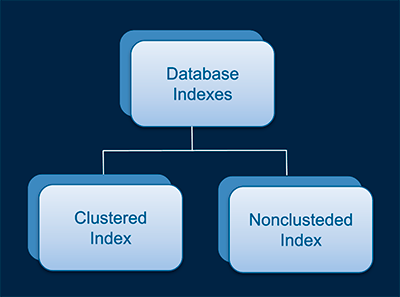
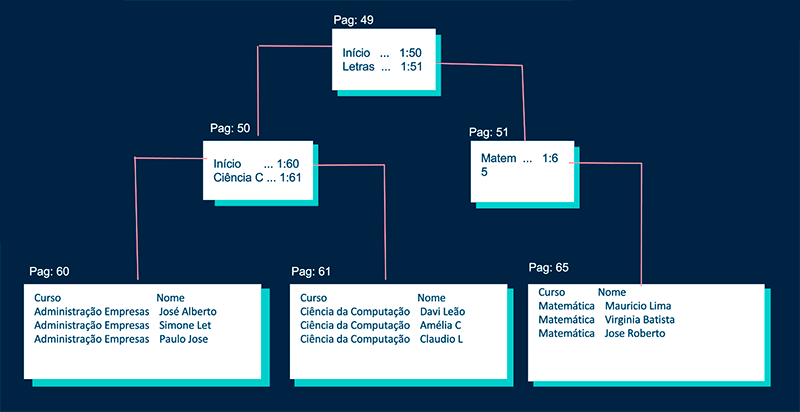
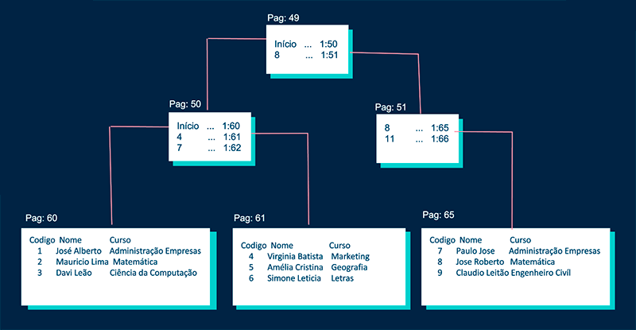

# Índices

São estruturas de acesso auxiliares, utilizadas para agilizar a recuperação de registros em resposta a certas condições de pesquisa. 

As estruturas de índice, são arquivos adicionais no disco que oferecem caminhos  de acesso secundários, os quais permitem formas alternativas de acessar os registros sem afetar seu posicionamento físico no arquivo de dados primário no disco.

Os índices são uma das ferramentas de otimização mais conhecidas e utilizadas pelos desenvolvedores de Banco de dados.



## Índice Clustered

- Índices clusterizado alteram a forma como os dados são armazenados em banco de dados, pois ele classifica as linhas de acordo com a coluna que possui o índice.
- Ele é montado na própria tabela, criando a estrutura ORDENADA de árvore para facilitar as buscas.
- Uma tabela só pode ter um índice clusterizado.
- Cada folha do índice clusterizado possui todas as informações do registro.
- Se uma tabela não possuir índice clusterizado, suas linhas são armazenadas em uma estrutura não ordenada chamada de HEAP.
- Exemplo clássico: Dicionário (Você localiza a palavra e junto com ela já tem a definição).

## Exemplo

**Código SQL:**
```sql
-- Criando a tabela ESTUDANTE
CREATE TABLE ESTUDANTE (
    Codigo_Estudante INT,
    Nome_Estudante VARCHAR(50),
    Idade_Estudante INT,
    Genero_Estudante VARCHAR(1),
    Curso_Estudante VARCHAR(50)
);

-- Inserindo registros na tabela ESTUDANTE
INSERT INTO ESTUDANTE (Codigo_Estudante, Nome_Estudante, Idade_Estudante, Genero_Estudante, Curso_Estudante)
VALUES
    (1, 'José Alberto', 20, 'M', 'Administração de Empresas'),
    (2, 'Mauricio Lima', 19, 'M', 'Matemática'),
    (3, 'Davi Leão', 25, 'M', 'Ciência da Computação'),
    (4, 'Virginia Batista', 30, 'F', 'Marketing'),
    (5, 'Amélia Cristina', 22, 'F', 'Geografia'),
    (6, 'Simone Letícia', 24, 'F', 'Letras');

-- Criando índice clusterizado na coluna Codigo_Estudante
CREATE CLUSTERED INDEX PK_Codigo_Estudante
ON ESTUDANTE(Codigo_Estudante);
```

## Índice Nonclustered
- Em um índice não clusterizado a forma como os dados são armazenados não é alterada, e um objeto separado é criado na tabela, apontando para as linhas da tabela original após a busca.
- É uma estrutura ORDENADA à parte, que contém apenas a coluna indexada (e as colunas do INCLUDE, caso exista) e uma tabela pode ter N índices deste tipo.
- Se for necessário consultar alguma informação que não está no índice NONCLUSTERED, a informação é localizada utilizando o índice clusterizado da tabela (Key Lookup)
- Exemplo clássico: Índice de um livro (Você localiza no índice a página onde está o capítulo e depois vai até a página para ver as informações).

## Exemplo

**Código SQL:**
```sql
-- Criando a tabela ESTUDANTE
CREATE TABLE ESTUDANTE (
    Codigo_Estudante INT,
    Nome_Estudante VARCHAR(50),
    Idade_Estudante INT,
    Genero_Estudante VARCHAR(1),
    Curso_Estudante VARCHAR(50)
);

-- Inserindo registros na tabela ESTUDANTE
INSERT INTO ESTUDANTE (Codigo_Estudante, Nome_Estudante, Idade_Estudante, Genero_Estudante, Curso_Estudante)
VALUES
    (1, 'José Alberto', 20, 'M', 'Administração de Empresas'),
    (2, 'Mauricio Lima', 19, 'M', 'Matemática'),
    (3, 'Davi Leão', 25, 'M', 'Ciência da Computação'),
    (4, 'Virginia Batista', 30, 'F', 'Marketing'),
    (5, 'Amélia Cristina', 22, 'F', 'Geografia'),
    (6, 'Simone Letícia', 24, 'F', 'Letras');

-- Criando índice não clusterizado na coluna Curso_Estudante
CREATE NONCLUSTERED INDEX IDX_Curso_Estudante
ON ESTUDANTE(Curso_Estudante);
```

## Cenário: Índice Clustered

Tabela com 5 colunas:                              
- Codigo_Estudante (Clustered)
- Curso_Estudante (Nonclustered) 
- Nome_Estudante     
- Idade_Estudante      
- Genero_Estudante

```sql
SELECT Codigo_Estudante,
       Nome_Estudante,
       Curso_Estudante
FROM ESTUDANTE
WHERE Codigo_Estudante = 6;
````



## Cenário: Índice Nonclustered

Tabela com 5 colunas:                              
- Codigo_Estudante (Clustered)
- Curso_Estudante (Nonclustered) 
- Nome_Estudante
- Idade_Estudante
- Genero_Estudante

```sql
SELECT Curso_Estudante,
       Nome_Estudante,
       Idade_Estudante
FROM ESTUDANTE
WHERE Curso_Estudante = 'Matemática';
````

