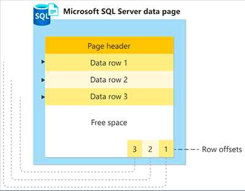
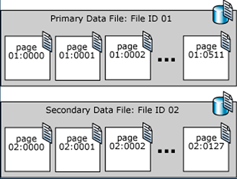

# Páginas
A unidade fundamental de armazenamento de dados no SQL Server é a página. O espaço em disco alocado a um arquivo de dados (.mdf ou .ndf) em um banco de dados é logicamente dividido em páginas numeradas de forma contígua de 0 a n.

Todas as páginas de dados têm o mesmo tamanho: 8kb. Cada página começa com um cabeçalho de 96 bytes, onde são armazenados as seguintes informações: número de página, tipo de página, quantidade de espaço livre na página e a ID de unidade de alocação do objeto que possui a página.

As linhas de dados são armazenadas em série na página, iniciando logo após o cabeçalho. Uma tabela de compensação da linha tem início no final da página, e cada tabela de compensação da linha contém uma entrada para cada linha na página. Cada entrada de compensação de linha armazena a distância do primeiro byte da linha em relação ao início da página, sendo a sua principal função ajudar o SQL Server a localizar linhas em uma página rapidamente. Essas entradas estão em sequência inversa da sequência das linhas na página.



As páginas de um arquivo de dados do SQL Server são numeradas em sequência, iniciando com zero (0) na primeira página do arquivo. Cada arquivo em um banco de dados tem um número de ID de arquivo exclusivo. Para identificar de forma exclusiva uma página em um banco de dados, são necessários ID do arquivo e número de página. O exemplo a seguir mostra os números de página em um banco de dados que tem um arquivo de dados primário de 4 MB e um arquivo de dados secundário de 1 MB.

Uma página de cabeçalho de arquivo é a primeira página que contém informações sobre os atributos do arquivo. Várias outras páginas do início do arquivo também têm informações de sistema, como mapas de alocação. Uma das páginas de sistema armazenada no arquivo de dados primário e no primeiro arquivo de log é uma página de inicialização de banco de dados que contém informações sobre os atributos do banco de dados.



Tipo de Página                   | Sumário
---------------------------------| ------
Dados                            | Linhas de dados com todos os dados, exceto os dados de texto, ntext, imagem, nvarchar(max), varchar(max), varbinary(max) e xml, quando o texto da linha estiver definido como ON.
Índice                           | Entradas de índice.
Texto/Imagem                     | Tipos de dados de objeto grande: dados text, ntext, image, nvarchar(max), varchar(max), varbinary(max) e xml. Colunas de comprimento variável quando a linha de dados exceder 8KB: varchar, nvarchar, varbinary e sql_variant.
GAM (Global Allocation Map)      | Informações sobre alocação de extensões.
PFS (Espaço livre na página)     | Informações sobre alocação de página e espaço livre disponível em páginas.
IAM (Mapa de alocação de índice) | Informações sobre extensões usadas por uma tabela ou índice por unidade de alocação.
BCM (Bulk changed map)           | Informações sobre extensões modificadas pelas operações em massa desde a última instrução BACKUP LOG por unidade de alocação.
DCM (Differential changed map)   | Informações sobre extensões modificadas desde a última instrução BACKUP DATABASE por unidade de alocação.

## Exemplos

**Código SQL:**
```sql
-- Deletando database caso exista
use master;
DROP DATABASE IF EXISTS Charlyane;

-- Criando BD
CREATE DATABASE Charlyane;

-- Utilizar o BD
USE Charlyane;

-- Testando os limites da criacao de paginas
CREATE TABLE Test (
    Descricao1 CHAR(4096),
    Descricao2 CHAR(4000)
);

-- Criando uma tabela com as linhas que utilizam ate 8KB
CREATE TABLE Test(
    Descricao1 CHAR(4000),
    Descricao2 CHAR(4000)
);

-- Inserindo valores na tabela
INSERT INTO Test (Descricao1, Descricao2) VALUES ('Descricao de teste 1', 'Descricao de teste 2');

-- Verificar espaco utilizado na tabela
sp_spaceused 'Test'

--Retornando a ID do banco de dados atual
SELECT DB_ID() AS [Database ID];
GO

-- Retornando informacoes da tabela
EXEC sp_help 'Test';

-- Retornando informacoes dos Bancos de dados ( DatabaseId, FileId)
SELECT * FROM sys.master_files

-- Retornando a quantidade de paginas alocadas
SELECT FILEPROPERTY ('TestDB', 'SpaceUsed') as 'Numero de paginas alocadas'

-- Retornando informacoes da pagina ( DatabaseId , FileId , PageId , Mode )
--'LIMITED' retorna valores NULL para todas as colunas de descricao; 'DETAILED' preenche as colunas de descricao
SELECT *
FROM sys.dm_db_page_info (5, 1, 1, DEFAULT);

-- Retornando as informacoes detalhadas das paginas ( DatabaseId , FileId , PageId , Mode )
-- 'LIMITED' retorna valores NULL para todas as colunas de descricao; 'DETAILED' preenche as colunas de descricao
SELECT *
FROM sys.dm_db_page_info (5, 1, 1, 'DETAILED');
```