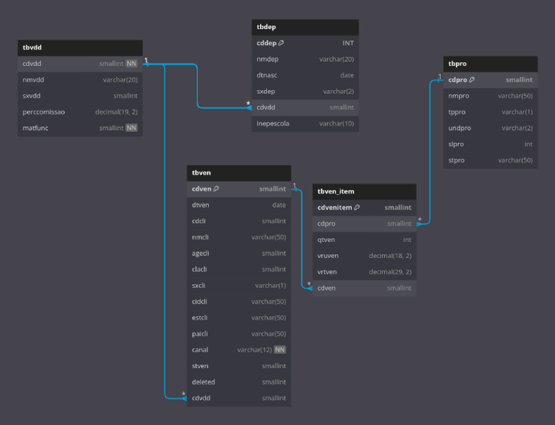

# Modelagem relacional

> **ATIVIDADE**: Elaborar o diagrama relacional com base [neste arquivo SQL](scripts/DigitalCollege_BD_Inserts.sql).

## Solução
Desenvolvi a solução utilizando a ferramenta online DBDiagram, a qual permite criar diagramas a partir do zero ou importar o arquivo SQL dos bancos de dados mais populares. Nesse contexto, utilizei o Postgres, que é o banco compatível com o script fornecido.

### Links:
- [Versão online na plataforma](https://dbdiagram.io/d/64e7534a02bd1c4a5e57ac8e)
- [Script SQL fornecido](scripts/DigitalCollege_BD_Inserts.sql)
- [Site da ferramenta](https://dbdiagram.io/)
