# Banco NoSQL com MongoDB


## Sobre
O **MongoDB** é um banco de dados NoSQL de código aberto que utiliza um modelo de documento flexível para armazenar dados. Ele suporta consultas poderosas, escalabilidade, replicação, sharding e é amplamente usado em aplicativos web e móveis. Sua comunidade ativa e serviços relacionados, como o MongoDB Atlas, tornam-no uma escolha popular para empresas que precisam de flexibilidade e escalabilidade em seu armazenamento de dados.

## Instalação
Aqui vou mostrar o passo a passo da instalação da Community Edition no Pop!_OS Linux. No entanto, [através do site](https://www.mongodb.com/try/download/community), você pode obter o instalador para a maioria dos sistemas operacionais.

1. Importe a chave pública usada pelo sistema de gerenciamento de pacotes
    - Em um terminal, instale o gnupg e o curl se eles ainda não estiverem disponíveis

        ```sh
        sudo apt-get install gnupg curl
        ```
    - Para importar a chave GPG pública do MongoDB execute o seguinte comando:
        ```sh
        curl -fsSL https://pgp.mongodb.com/server-7.0.asc | \
        sudo gpg -o /usr/share/keyrings/mongodb-server-7.0.gpg \
        --dearmor
        ```
2. Crie um arquivo de lista para MongoDB
    ```sh
    echo "deb [ arch=amd64,arm64 signed-by=/usr/share/keyrings/mongodb-server-7.0.gpg ] https://repo.mongodb.org/apt/ubuntu jammy/mongodb-org/7.0 multiverse" | sudo tee /etc/apt/sources.list.d/mongodb-org-7.0.list
    ```
3. Atualizar pacotes locais
    ```sh
    sudo apt-get update
    ```
4. Instale os pacotes MongoDB
    ```sh
    sudo apt-get install -y mongodb-org
    ```
5. Checando a instalação
    ```sh
    mongod –version
    ```
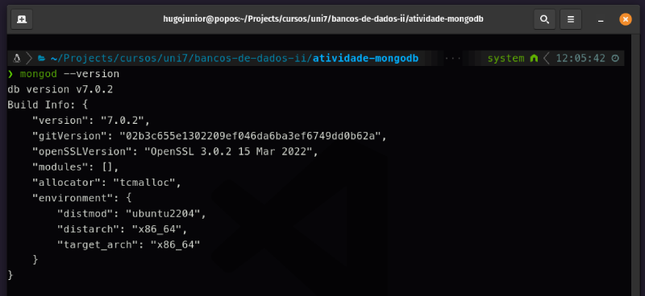

## Iniciando o serviço
Para iniciar o serviço, utilize o comando abaixo, substituindo '\<diretório\>' pela pasta do sistema onde seu banco de dados deve ser armazenado:

```sh
mongod --dbpath <diretório>
```
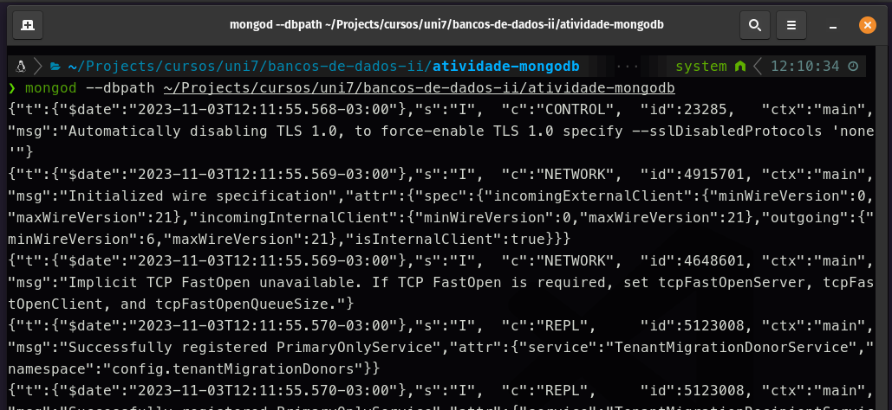

**Observação**: Mantenha a janela aberta para manter a sessão ativa que você criou e use uma nova janela para executar os comandos das próximas etapas.

## Acessando o MongoDB
Para acessar, utilize o seguinte comando no seu terminal:

```sh
mongosh
```
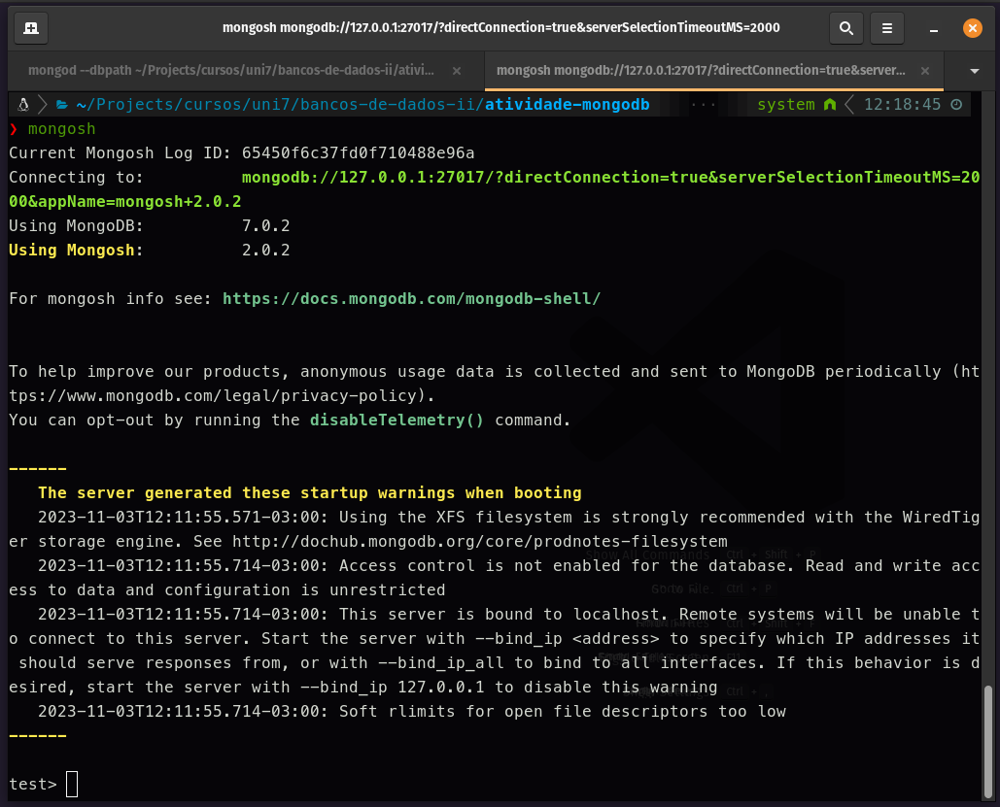

## Listando os banco de dados
Para listar os bancos de dados, é semelhante ao que já conhecemos em bancos de dados relacionais. Você deve executar o seguinte comando:

```mongodb
show databases;
```
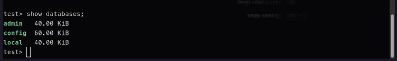

## Selecionando um banco de dados
Para selecionar um banco de dados, é semelhante ao que já conhecemos em bancos de dados relacionais. Você deve executar o seguinte comando:

```mongodb
use <nome-do-banco>;
```
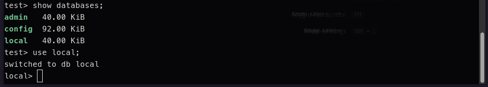

## Criando um novo banco de dados
Para criar um novo banco de dados, basta usar o comando de seleção e, se o banco não existir, ele será criado:

```mongodb
use db-uni7;
```
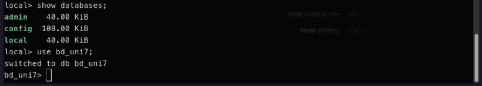

## Excluindo um banco de dados
Para excluir um banco de dados, você deve selecionar o banco de dados e executar o seguinte comando:

```mongodb
db.dropDatabase();
```
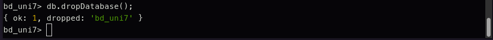

## Criando uma coleção
Para criar uma coleção, você basicamente precisa inserir registros.

```mongodb
db.professores.insert({
    nome: 'Alex Souza', 
    curso: 'Banco de Dados II', 
    dataNascimento: '2000-01-01', 
    cod: 1, 
    ativo: true
});
```
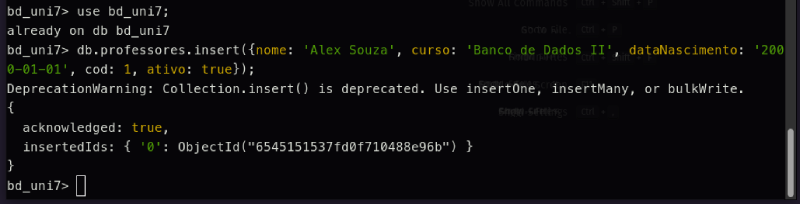
Nesse caso, estou criando uma coleção chamada 'professores'.

## Listando as coleções do banco de dados
Para listar as coleções, selecione o banco e utilize o seguinte comando:

```mongodb
show collections;
```
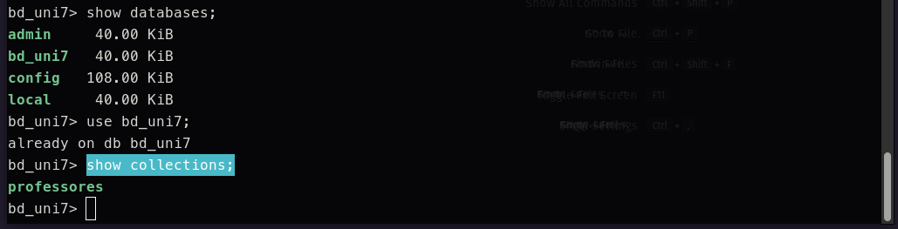

## Selecionado os dados da coleção
Para listar os dados cadastrados na coleção, você deve utilizar o seguinte comando:

```mongodb
db.professores.find();
```
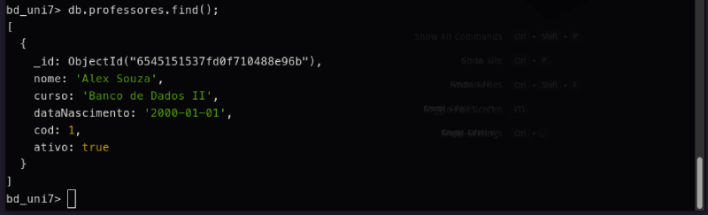
Nesse caso, estou selecionando os dados da coleção de professores, que possui apenas um registro.

## Filtrando dados da coleção
Inicialmente, vamos inserir mais professores na nossa coleção para facilitar a visualização dos filtros:

```mongodb
db.professores.insert({
    nome: 'Robério Gomes', 
    curso: 'Sistemas Distribuídos', 
    dataNascimento: '2001-01-01', 
    cod: 2, 
    ativo: 
    false
});
db.professores.insert({
    nome: 'Alan Bessa', 
    curso: 'Análise de Projetos e Sistemas I', 
    dataNascimento: '2002-02-01', 
    cod: 3, 
    ativo: true
});
db.professores.insert({
    nome: 'Marcelo Bezerra', 
    curso: 'Estágio Supervisionado II', 
    dataNascimento: '2003-03-01', 
    cod: 4, 
    ativo: true
});
db.professores.insert({
    nome: 'Alex Ferreira', 
    curso: 'Redes de Computadores II', 
    dataNascimento: '2004-04-01', 
    cod: 5, 
    ativo: false
});
db.professores.insert({
    nome: 'Alexandre Cavalcante', 
    curso: 'Computação gráfica', 
    dataNascimento: '2005-05-01', 
    cod: 6, 
    ativo: true
});
```
Após inserir os dados, você pode usar o seguinte comando para visualizar a quantidade de registros na coleção:

```mongodb
db.professores.countDocuments();
```
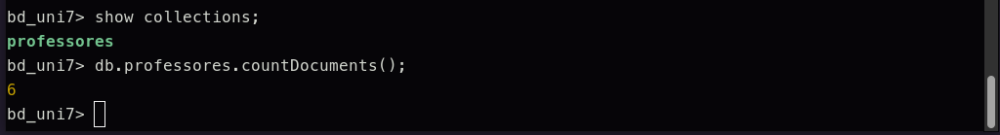

Para filtrar os dados, você deve fornecer os parâmetros para a função find():

```mongodb
db.professores.find({
    ativo: true,
    dataNascimento: {
        $gt: '2002-01-01'
    }
});
```
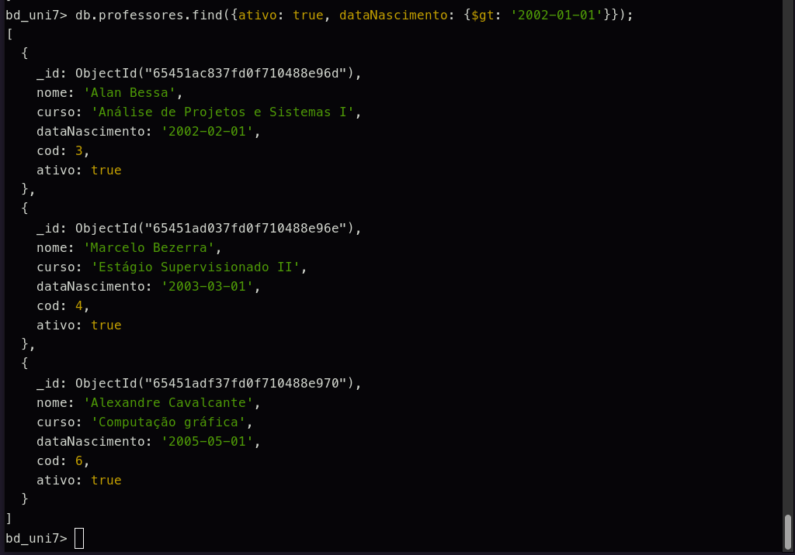
Você pode utilizar $gt para representar maior e $lt para representar menor.

## Campos específicos por registro
Ao contrário dos bancos de dados relacionais, no modelo não relacional, podemos adicionar campos em cada registro sem a necessidade de alterar a estrutura da tabela.

```mongodb
db.professores.insert({
    nome: 'Commin Nunes', 
    curso: 'Sistemas de Apoio a Decisão', 
    dataNascimento: '2006-06-01', 
    cod: 7, 
    ativo: true, 
    coordenador: true
});

```
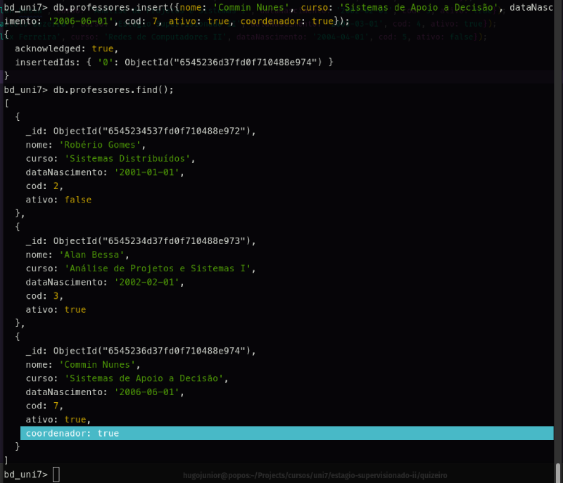
Nesse caso, o novo professor possui um campo de coordenador que os outros não possuem.

## Relacionando os dados
Apesar de ser um banco de dados não relacional, é possível estabelecer relacionamentos no MongoDB por meio da função aggregate().

Para ilustrar esse cenário, vamos criar uma segunda coleção chamada 'provas', que armazenará as datas das provas para cada professor:

```mongodb
db.provas.insert({data: '2023-12-01', cod_prof: 1});
db.provas.insert({data: '2023-12-02', cod_prof: 2});
db.provas.insert({data: '2023-12-01', cod_prof: 3});
db.provas.insert({data: '2023-12-02', cod_prof: 4});
db.provas.insert({data: '2023-12-04', cod_prof: 5});
db.provas.insert({data: '2023-12-06', cod_prof: 6});
db.provas.insert({data: '2023-12-05', cod_prof: 7});
```

Agora vamos utilizar o comando para agregar os registros:

```mongodb
db.professores.aggregate([
    {
        $lookup: {
            from: 'provas',
            localField: 'cod',
            foreignField: 'cod_prof',
            as: 'provas'
        }
    }
]);
```

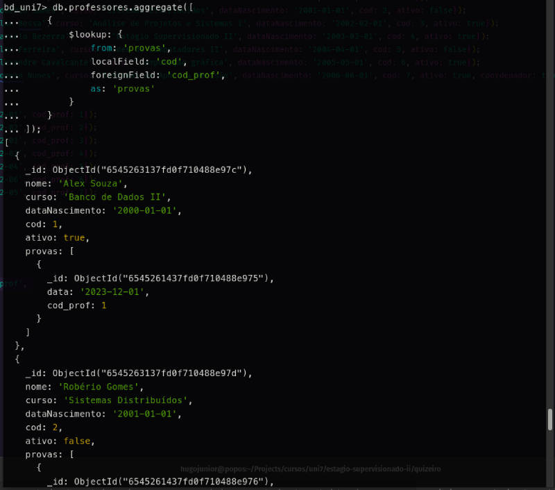
Agora a coleção de professores possui um relacionamento com a coleção de provas por meio do campo 'provas'.

## Pasta de arquivos
Como ficou a pasta de arquivos que selecionamos no início da atividade:

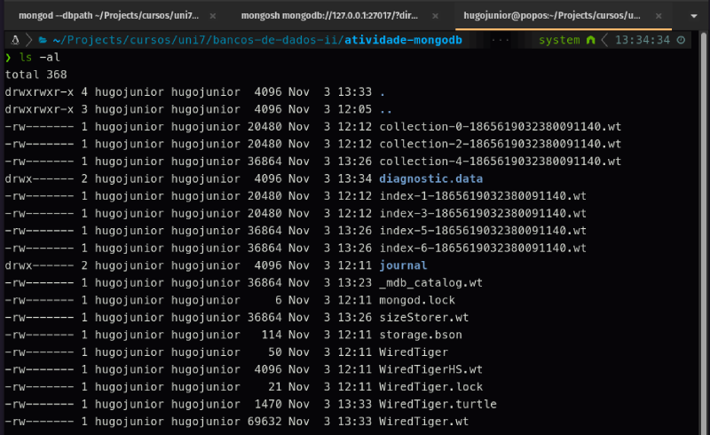

---
**Outros Formatos:**
- [Google Docs](https://docs.google.com/document/d/1Y2EMkq6CUi94qQlzq7kt16g8iHSZM3o9NUgBhBC9kBU/edit?usp=sharing)

**Referências:**
- [Site oficial do MongoDB](https://www.mongodb.com/)
- [Youtube - NOSQL - Criando seu primeiro BD NOSQL no MongoDb](https://youtu.be/LYtgbSP5OMs?si=oxM4P_wNJVof2SOk)
  