# Resumo do que foi visto

## Visão geral do SQL Server
O SQL Server da Microsoft é um sistema para gerenciar grandes volumes de dados de forma eficiente. Ele suporta a linguagem SQL, é usado para criar e proteger bancos de dados, e é popular em ambientes empresariais e de desenvolvimento.

### Administração do SQL Server
- Instalação e Configuração;
- Criação e Gerenciamento de Bancos de Dados;
- Segurança e Autorização;
- Backup e Restauração;
- Monitoramento e Otimização de Desempenho;
- Tarefas de Manutenção;
- Alta Disponibilidade e Tolerância a Falhas;
- Atualizações e Patches;
- Resolução de Problemas;
- Auditoria e Conformidade;

### Tipos de Arquivos do SQL Server
1. **.MDF** (madeira 😆 ): Master Data File são os arquivos de dados e principais repositórios onde os dados do banco de dados são armazenados.
2. **.LDF**: Log Database File são os arquivos de log responsáveis por registrar todas as atividades e transações que ocorrem no banco de dados.

### Bancos de Dados de Sistema
São bancos de dados que possuem funções específicas e desempenham um papel crucial na operação geral do SQL Server.

- Banco de Dados Master;
- Banco de Dados msdb;
- Banco de Dados Tempdb;
- Banco de Dados Model;

### Páginas no SQL Server
No SQL Server, os dados são armazenados em unidades chamadas "páginas". Cada página tem um tamanho fixo de 8 KB (kilobytes) por padrão, embora esse valor possa variar dependendo da configuração.

#### Páginas na prática
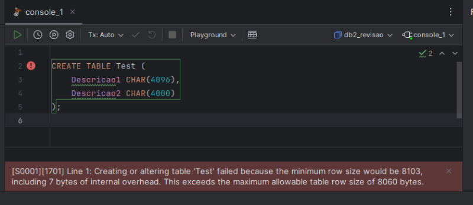
> Simulando os limites das páginas de dados

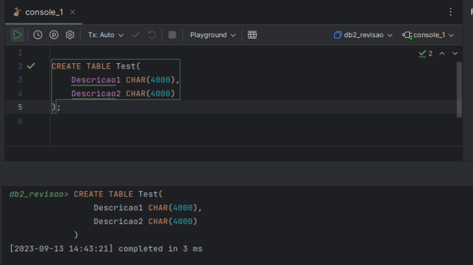
> Simulando uma tabela dentro do limite de 8kb

> Verificando o espaço antes de inserir dados

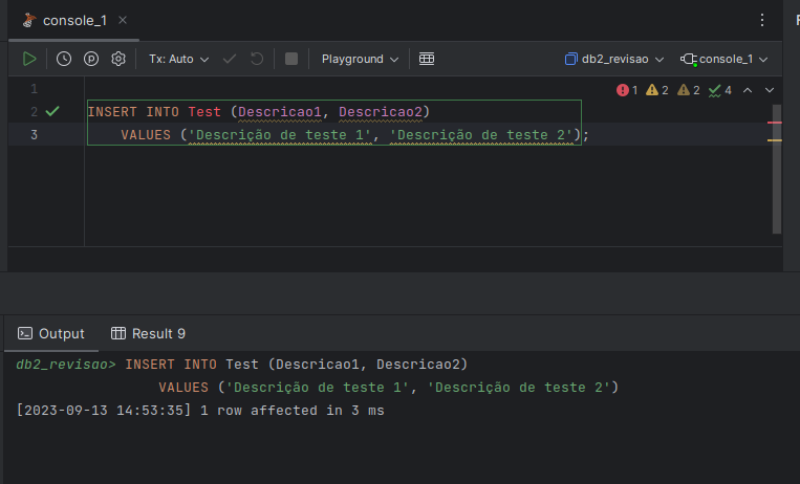
> Inserindo dados de teste

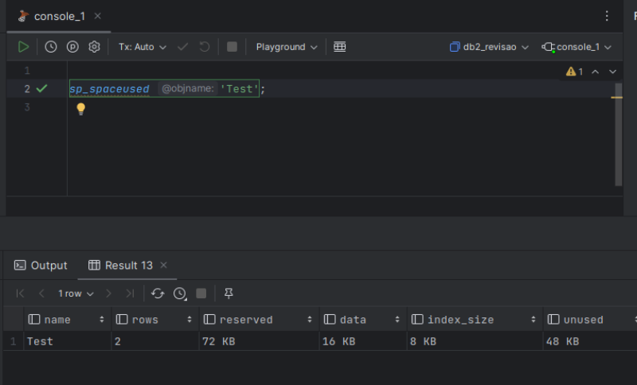
> Verificando o espaço após inserir dados

### Índices no SQL Server
A indexação é fundamental para otimizar a recuperação de dados em bancos de dados grandes. Os índices são estruturas de dados que permitem que o SQL Server localize rapidamente os registros que atendem a determinadas condições de pesquisa.

#### Índices na prática

> Criação da tabela de clientes

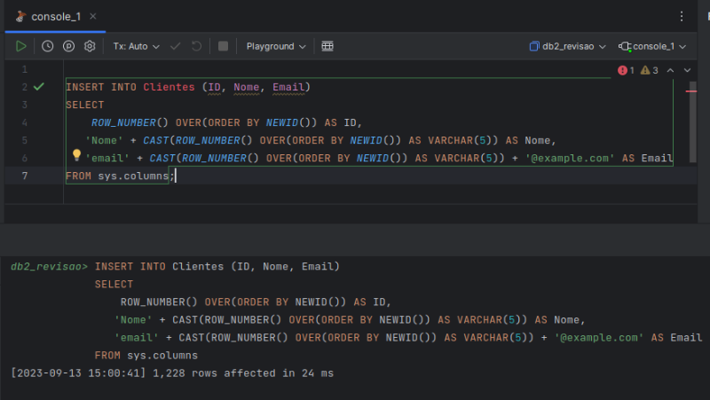
> Inserção de dados na tabela

> Criação de índice não clusterizado

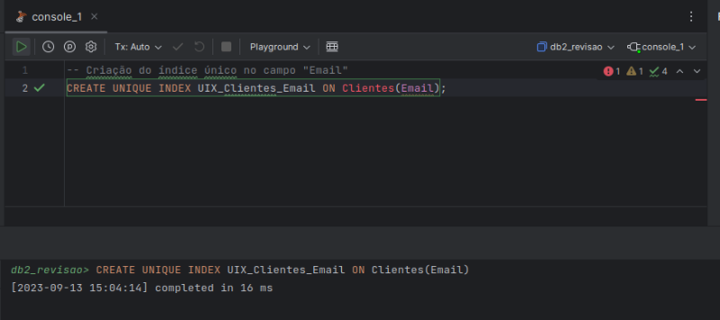
> Criação de índice único para o campo de e-mail

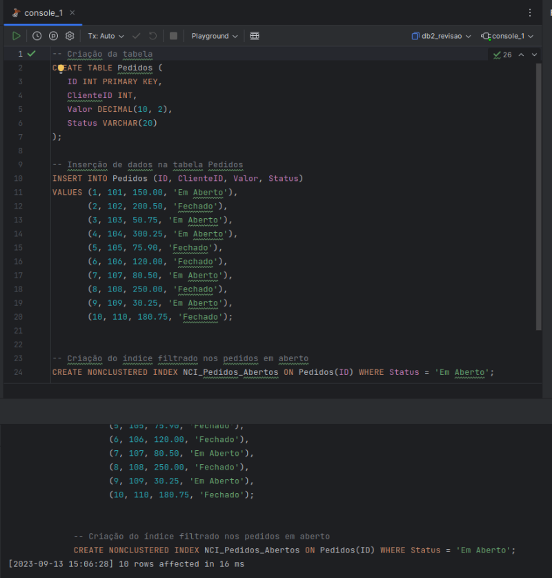
> Criação do índice filtrado nos pedidos em aberto

#### Fragmentações na prática
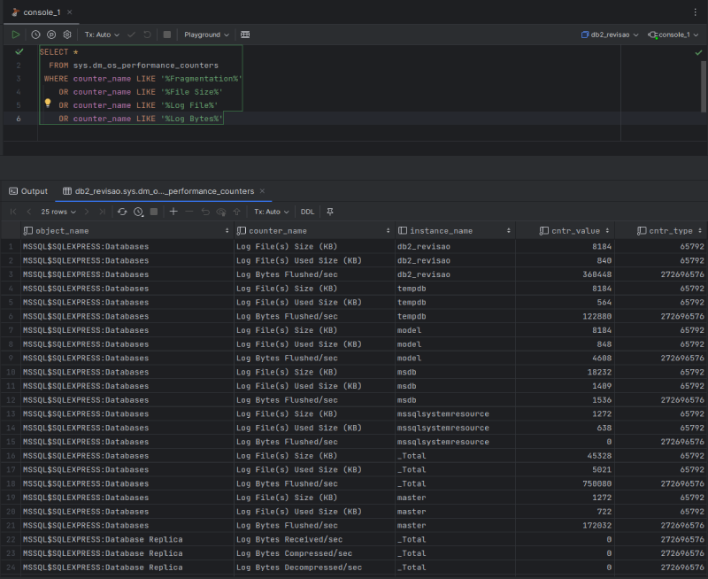
> Fragmentação de leitura

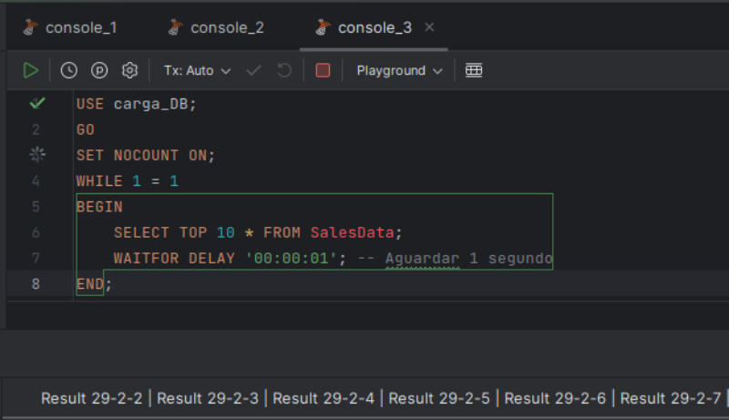
> Executando carga de dados e fragmentação

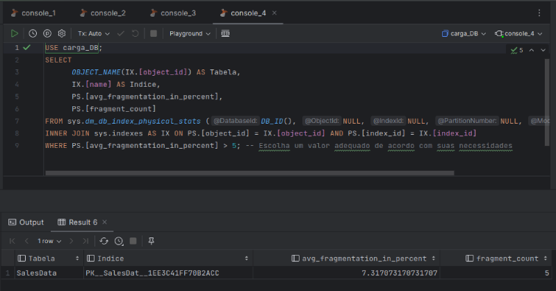
> Consulta de fragmentação

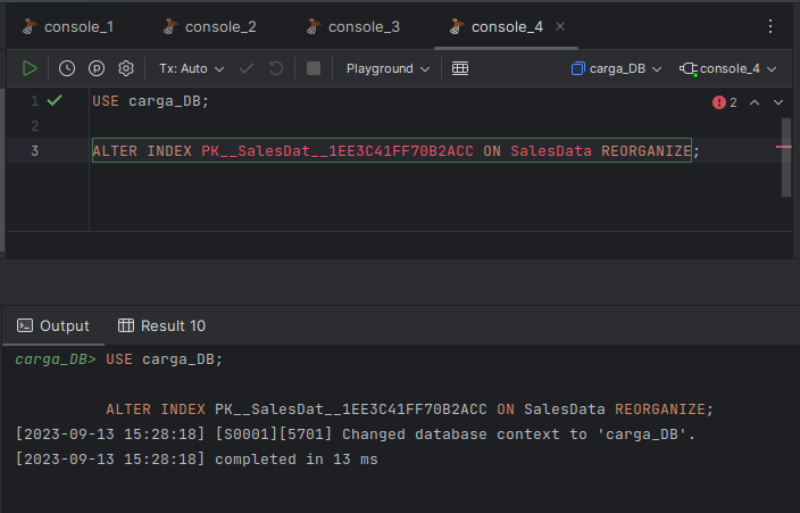
> Reorganizando índices

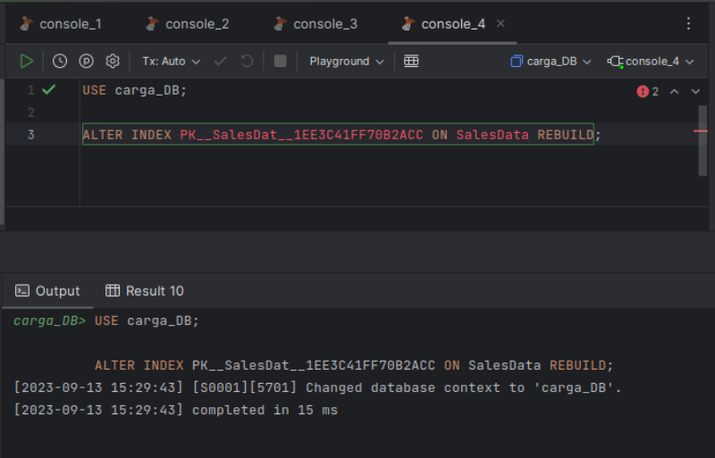
> Recriando índices

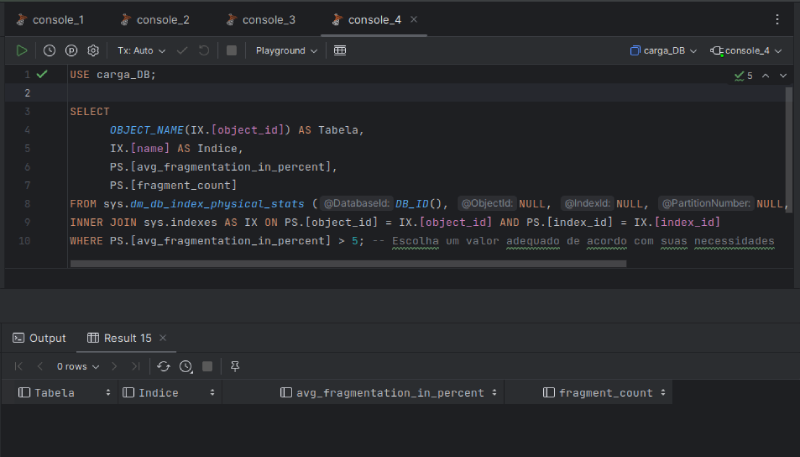
> Consulta de fragmentação após recriar os índices

### Melhores Práticas
- Backups:
    - Backup Completo;
    - Backup Diferencial;
    - Backup de Log;
- Monitoramento;
- Manutenção Regular;
- Backup e Restauração;
- Páginas e Memória;
- Planejamento de Indexação;
- Monitoramento de Desempenho;

## Arquitetura Interna de um SGBD
Um sistema de banco de dados consiste em informações relacionadas entre si e um conjunto de aplicativos que possibilitam aos usuários acessar e editar essas informações de maneira eficaz.

### Principais características da tecnologia de SGBDs
- Independência de Dados;
- Linguagem de Consulta para Fácil Manipulação dos Dados;
- Controle da Redundância e Inconsistência de Dados;
- Gerenciamento do Acesso Concorrente por Vários Usuários;
- Tratamento do Acesso Não Autorizado

### Sistema de Bancos de Dados (SBD ou DBS)
- Sistema Gerenciador de Bancos de Dados (SGBD ou DBMS)
- Banco de Dados (BD ou DB)

### Instâncias e Esquemas
- **Esquemas**: estrutura lógica do banco de dados.
- **Instâncias**: conteúdo real do BD em um determinado ponto no tempo.

### Visão de Dados (Abstração de Dados)
O SBD abstrai o processo complexo de manter e recuperar dados de maneira eficiente através das visões de dados.

### Níveis de Abstração de Dados
- Nível físico
- Nível lógico
- Nível de visão

### Arquitetura Interna SBD
Dividido em módulos com responsabilidades definidas:

- Processador de Consulta
- Gerenciador de Armazenamento

### Módulos Componentes do SGBD
Os módulos/componentes de um Sistema de Gerenciamento de Banco de Dados (SGBD) são partes essenciais que desempenham funções específicas para gerenciar eficazmente os dados. Isso inclui módulos para entrada e recuperação de dados, gerenciamento de segurança, processamento de consultas, armazenamento e manipulação de dados, entre outros. Cada módulo desempenha um papel fundamental na operação e no desempenho global do SGBD, garantindo que os dados sejam armazenados, acessados e protegidos de forma adequada.

### Disco
Os discos de armazenamento desempenham um papel fundamental na velocidade de acesso aos dados, na capacidade de lidar com cargas de trabalho intensivas e na confiabilidade do servidor. Os tipos mais comuns:

- HDDs (Hard Disk Drives)
- SSDs (Solid State Drives)
- NVMe SSDs (Non-Volatile Memory Express SSDs)
- RAID (Redundant Array of Independent Disks)
- Dispositivos de Armazenamento em Nuvem
- Armazenamento Híbrido e de Nível

### Memória
As memórias afetam diretamente a velocidade de processamento e a capacidade do servidor de manipular grandes volumes de dados em tempo real. Os tipos mais comuns:

- DRAM (Dynamic Random-Access Memory)
- NVDIMM (Non-Volatile Dual In-Line Memory Module)
- Optane Persistent Memory (PMem)
- HBM (High Bandwidth Memory)
- Memória em Nuvem
- DDR5 (Double Data Rate 5)

### Processador
A escolha do processador para servidores de banco de dados é uma decisão crucial, pois afeta diretamente o desempenho, a capacidade de resposta e a eficiência do sistema.

- Processadores Intel Xeon
- Processadores AMD EPYC
- Processadores ARM para Servidores
- Processadores Intel Core i9 e AMD Ryzen Threadripper
- Processadores com GPU Integrada
- Processadores Quantum

---
**Outros Formatos:**
- [Google Docs](https://docs.google.com/document/d/1e6JHMfygbp4E7viNWKPF1rXxtSoCU1qf_RRngjrbl28/edit?usp=sharing)

**Referências:**
- [Material da Disciplina (privado)](https://github.com/aasouzaconsult/BDII)
- [ChatGPT](https://chat.openai.com/)