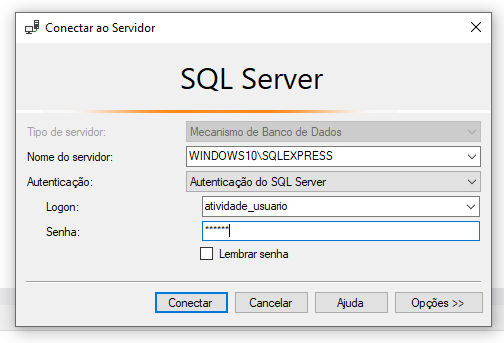
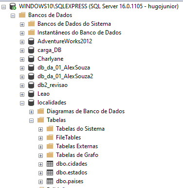
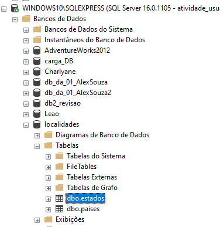
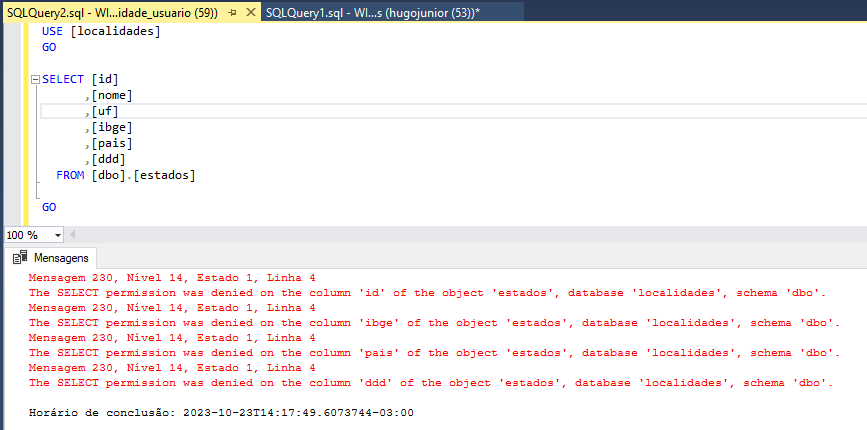
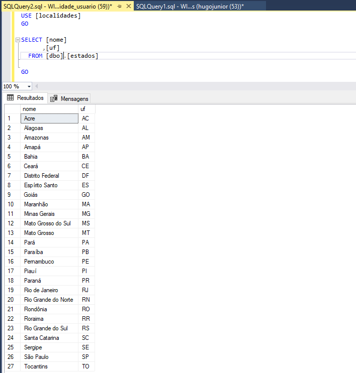
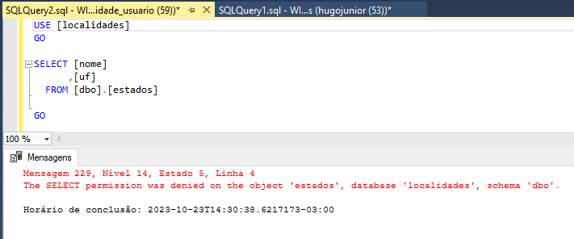
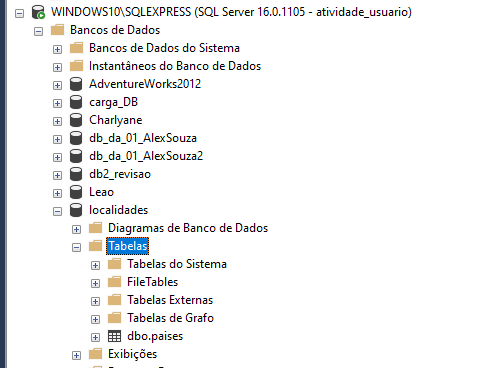
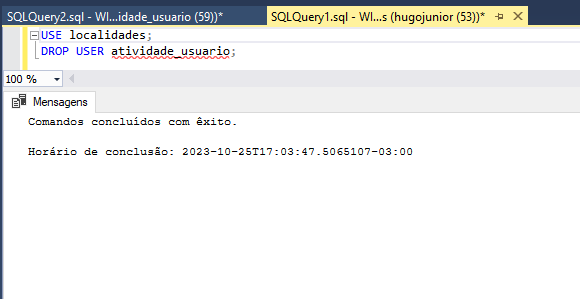
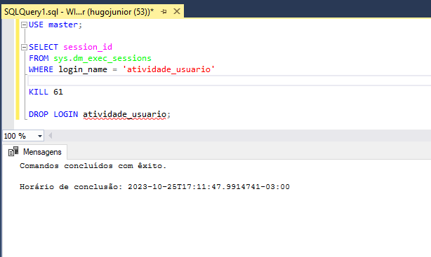

# Segurança (Grant/Revoke)


## Conteúdo utilizado nessa atividade
Os scripts usados para fazer essa atividade estão [aqui](scripts.sql).

Se quiser simular os testes nas mesmas tabelas, seguem:
- Tabela de Países [aqui](1.tabela-paises.sql).
- Tabela de Estados [aqui](2.tabela-estados.sql).

## Criando o login no servidor
```sql
USE master;
CREATE LOGIN atividade_usuario WITH PASSWORD = '******';
```

## Criando o usuário do banco de dados associado ao login
```sql
USE localidades;
CREATE USER atividade_usuario FOR LOGIN atividade_usuario;
```

## Concedendo permissões no banco localidades
1. Permissão nas colunas nome e sigla da tabela de países:
    ```sql
    GRANT SELECT ON OBJECT::paises(nome, sigla) TO atividade_usuario;
    ```
2. Permissão nas colunas nome e uf da tabela de estados:
    ```sql
    GRANT SELECT ON OBJECT::estados(nome, uf) TO atividade_usuario;
    ```
## Conectando com o usuário criado

> Logando com o usuário criado

## Verificando as tabelas com usuário padrão (hugojunior)

> As tabelas países, estados e cidades são exibidas

## Verificando as tabelas com o usuário criado (atividade_usuario)

> Apenas as tabelas países e estados são exibidas

## Consultando todos os campos da tabela de Estados com novo usuário

> Não é permitido pois a permissão foi dada apenas a nome e uf

## Consultando pelos campos que foram concedidos permissão

> A consulta é realizada com sucesso e mostra todos os estados

## Revogando permissão de estados
```sql
REVOKE SELECT ON OBJECT::estados(nome, uf) FROM atividade_usuario;
```

## Fazendo a mesma consulta após revogar permissões

> Não é permitido a consulta pois o usuário não tem mais permissões de consultar colunas dessa tabela

## Na listagem de tabelas do usuário só é listado a tabela de países agora

> Como as permissões de países não foram revogadas, o usuário ainda tem acesso

## Removendo o usuário criado
```sql
USE localidades;
DROP USER atividade_usuario;
```

> Importante que o comando seja executado com outro usuário

## Removendo o login no servidor
```sql
USE master;

SELECT session_id
FROM sys.dm_exec_sessions
WHERE login_name = 'atividade_usuario'

KILL 61

DROP LOGIN atividade_usuario;

```

> Pode ser necessário encerrar a sessão ativa, troque o 61 pelo session_id

---
**Outros Formatos:**
- [Google Docs](https://docs.google.com/document/d/1BlCH5nWFUOZ10nKT6imsKQHdKPquQbOP6X4-iD7Vpy4/edit?usp=sharing)

**Referências:**
- [Medium - GRANT And REVOKE In SQL Server](https://vaishaligoilkar3322.medium.com/grant-and-revoke-in-sql-server-62ef393e743)
- [ChatGPT](https://chat.openai.com/)