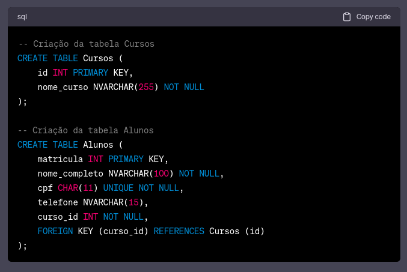
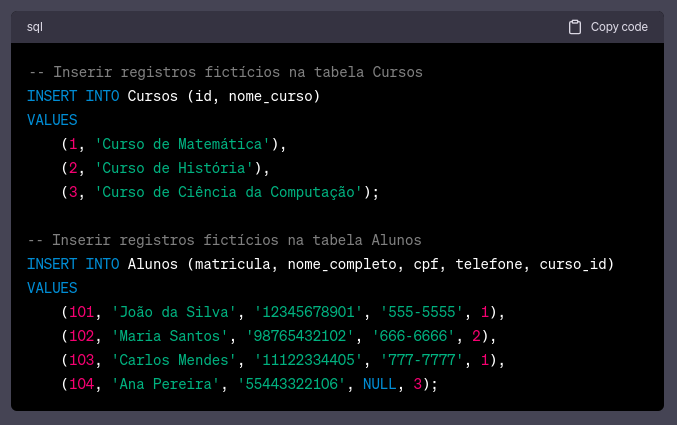
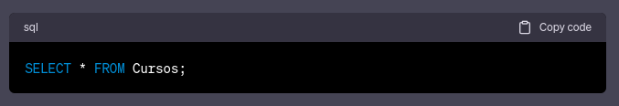
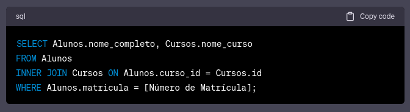
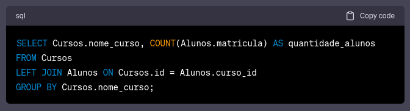
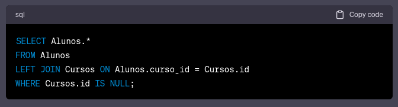

# SQL com IA Generativa


> **ATIVIDADE**: Quem tem 1 Atividade faltando - Pedir para uma Generative AI, criar 2 tabelas, informe para ele o nomes das tabelas, os campos, qual a relação entre elas e peça para ele criar essas tabelas, inserir dados e gerar algumas consultas.

Usei o [chatGPT](https://chat.openai.com) para essa tarefa.

## Gerando tabelas
### Prompt
```
Crie as instruções SQL para criar duas tabelas no SQL Server. Uma delas será denominada 'Cursos' e conterá os seguintes campos:
- 'id' (chave primária)
- 'nome_curso' (texto obrigatório)
A segunda tabela será chamada 'Alunos' e terá os seguintes campos:
- 'matrícula' (chave primária)
- 'nome_completo' (texto obrigatório com até 100 caracteres)
- 'cpf' (apenas números, obrigatório, único e com exatamente 11 caracteres)
- 'telefone' (texto opcional com até 15 caracteres)
- 'curso_id' (chave estrangeira para relacionamento com a tabela 'Cursos', obrigatório para representar um relacionamento onde cada aluno pode ter apenas um curso).
```
### Resultado


## Gerando dados
### Prompt
```
Crie registros em cada uma das tabelas com dados fictícios
```
### Resultado


## Gerando consultas
### Prompt
```
Crie algumas consultas aleatórias que relacionem essas duas tabelas
```
### Resultado
#### Listar todos os cursos:


#### Listar todos os alunos e o curso que estão cursando:


#### Encontrar o curso de um aluno específico pelo número de matrícula:


#### Listar todos os cursos e a quantidade de alunos em cada curso:


#### Encontrar todos os alunos que não estão atualmente matriculados em nenhum curso:


---
**Outros Formatos:**
- [Google Docs](https://docs.google.com/document/d/1PwKY0ayeWYLy800srLoyIaOU1ngHfYQSOo1okp4Pkjs/edit?usp=sharing)

**Referências:**
- [ChatGPT](https://chat.openai.com/)

