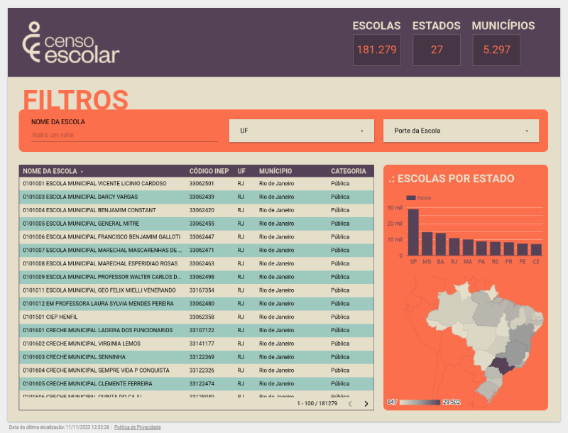

# Visualização de Dados

**Atividade:** Assista [ao vídeo](https://www.youtube.com/watch?v=2VSF4IaF_OE) e reproduza os relatórios gerados utilizando uma ferramenta de visualização de dados, como Power BI, Looker Studio, etc.

## Solução
Desenvolvi a visualização de dados utilizando a mesma base de dados (Censo Escolar 2020), empregando a ferramenta [Looker Studio](https://lookerstudio.google.com/) do Google:

### Links:
- [Base de dados em CSV](https://drive.google.com/file/d/1RfNTRvmnfQ68RljpajxBfjBR811az_tl/view?usp=sharing)
- [Base de dados em Planilha Google](https://docs.google.com/spreadsheets/d/1oob58iN2CtirT0BJKZ3ln8x9cpJzJ7S_FsU0IT4xuIc/edit?usp=sharing)
- [Relatório final no Looker Studio](https://lookerstudio.google.com/s/gEwRdhofWlE)